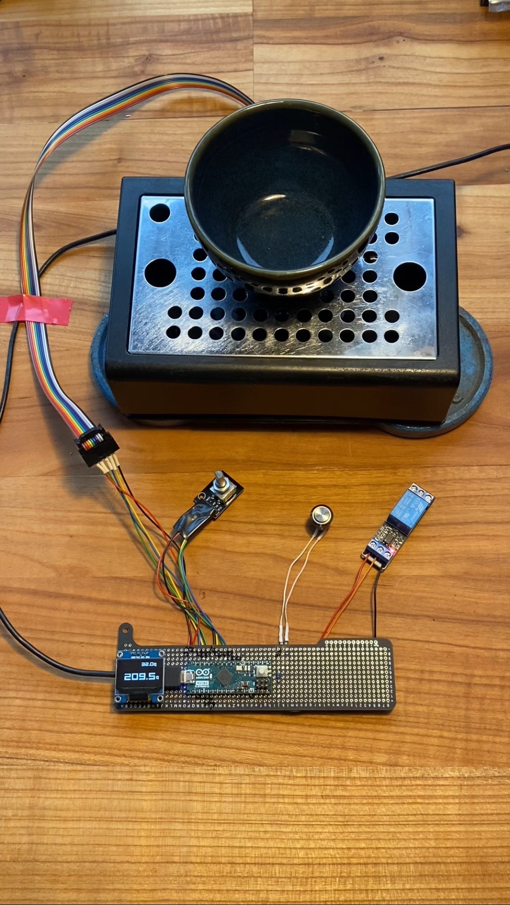
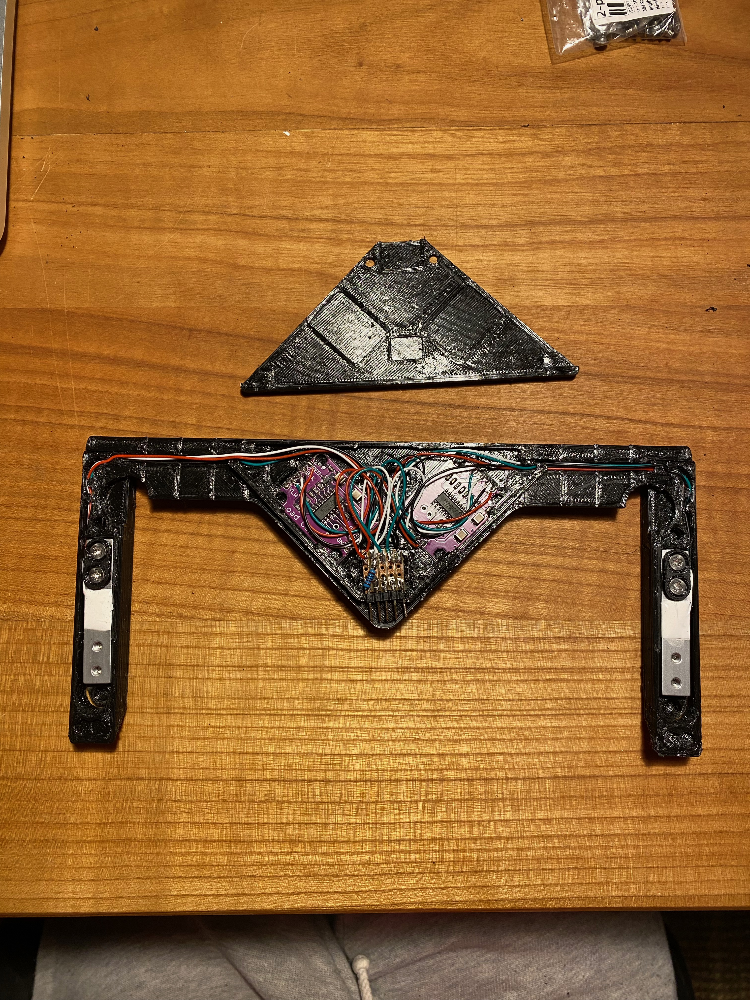
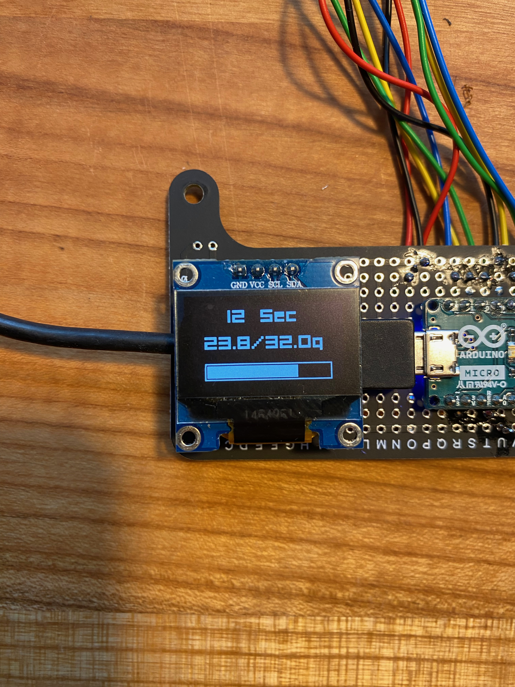
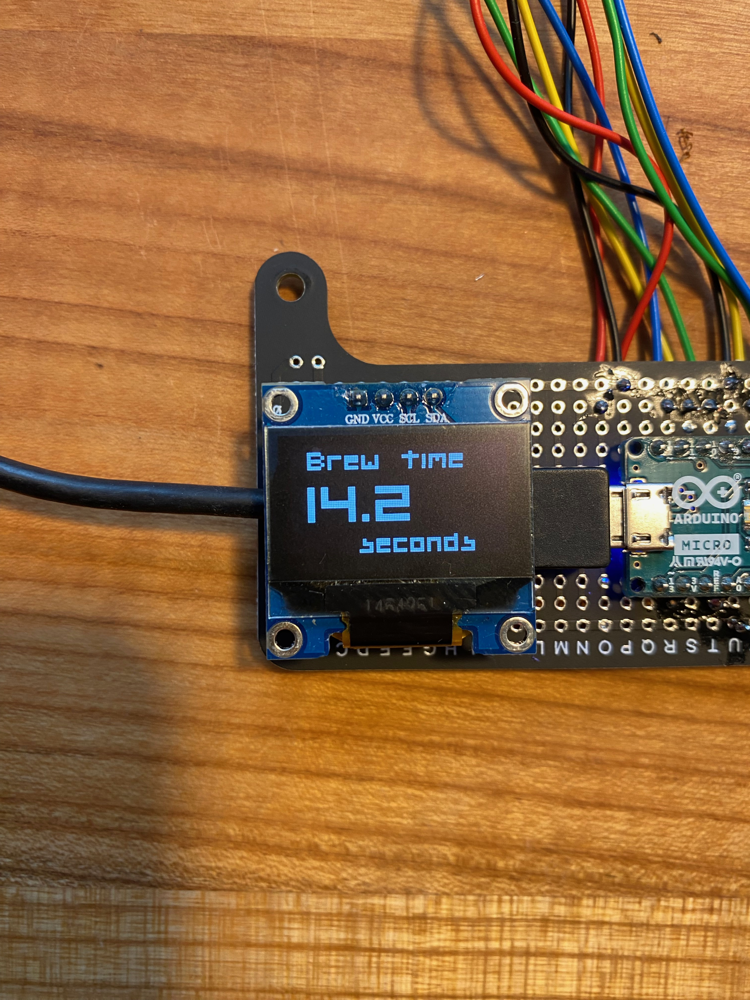
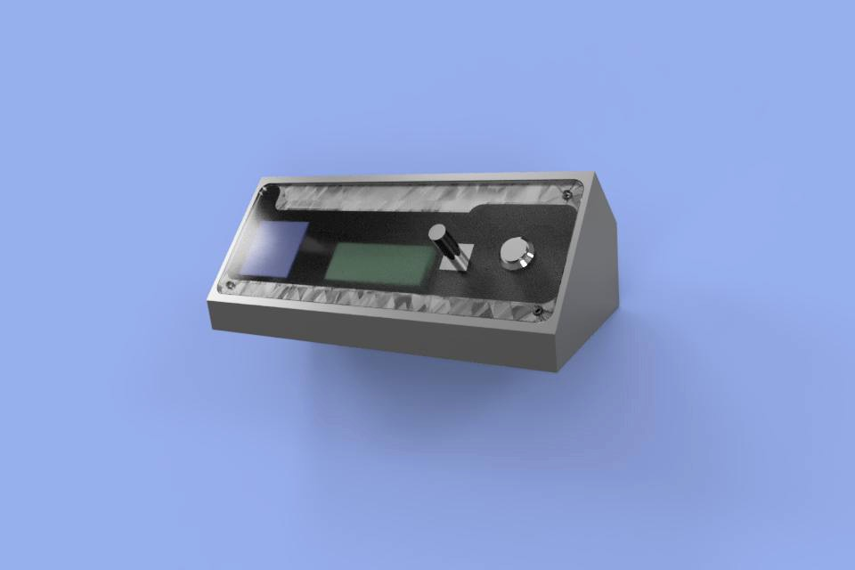
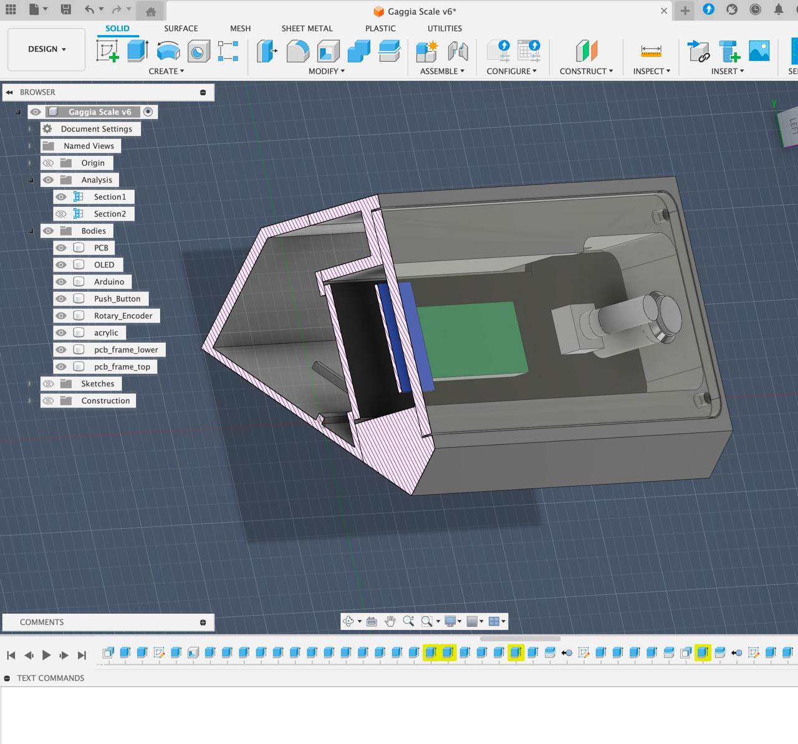

# Gaggia Scale Module
A precision scale integration for Gaggia espresso machines, solving the common problem of limited space between the portafilter and drip tray.
## 🎯 Project Overview
This project was inspired by the excellent Gaggiuino Project, but focuses specifically on integrating a precision scale directly into the machine base. The built-in scale eliminates the need for external scales and maximizes the limited space in compact espresso machine setups.

For a video of the build in action follow this [link] (https://www.youtube.com/shorts/G5Hq_KEejkw)

## 🔧 Hardware Components

 - Load Cells: Precision weight sensors mounted beneath the drip tray
 - Arduino Nano: Main microcontroller for processing and control
 - 2x 750g loadcells
 - 2x HX711 Amplifier Boards: Signal amplification for load cell data
 - Rotary Encoder with Push Button: User interface for target weight setting and tare function
 - 240VAC -> 12vDC transformator
 - AC relay to bypass the brew switch
 - PushButton

further components are
 - 3D Printed Mount: Custom load cell mounting system (files adapted from Gaggiuino project)
 - 3D Printed / Laser cut terminal

## ⚙️ Features
Weight Measurement

Real-time weight display with high precision
Stable readings compensated for vibration and temperature drift

Target Weight Setting

Adjustable target weight via rotary encoder
Visual feedback when target weight is reached
Persistent storage in EEPROM (survives power cycles)

Tare Function

One-button tare to zero via rotary encoder push button

## Links

for more information and fotos visit my [Hackaday.io page] (https://hackaday.io/project/203943-gaggia-classic-scale-mod)
